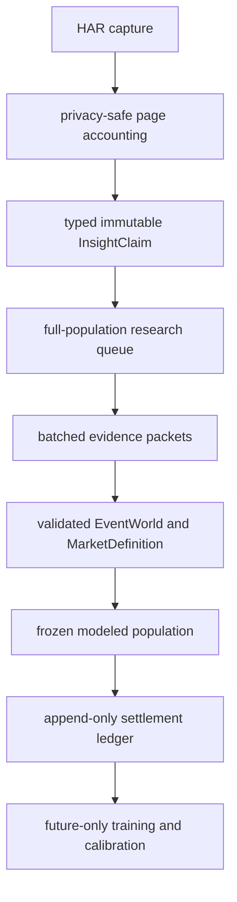

# Outlier Insights adapter and settlement contract

Status: implemented as a shadow/research path in DCM 6.0.  It is not a production selection certification.

## Purpose

Outlier `/insights` responses are historical signal snapshots.  They are not the same object as a live market-board projection and they do not contain the official result of the listed event.  This contract gives them a typed path through the DCM without allowing a vendor streak, a stale line, a team moneyline, or an unresolved settlement rule to become a player-prop prediction.



## Non-negotiable invariants

1. Every supplied HAR is parsed separately and identified by its byte SHA-256.  File names are not identity.
2. Raw HAR bytes, response bodies, URLs, headers, cookies, free-form insight text, and opaque book identifiers stay outside the normalized archive.
3. Pagination is tri-state: `ABSENT`, `TERMINAL_NULL`, or `NONEMPTY`.  `NONEMPTY` is retained for accounting but is not queue-eligible until all pages are captured.
4. Full-board accounting precedes ranking.  The queue is an attention list, not a prediction list.
5. `OVER`/`UNDER` are canonicalized to `HIGHER`/`LOWER`.  `HOME`/`AWAY` team outcomes are a separate market class; the inverse side is never invented.
6. `hitRate` and `lastN` are historical features only.  They are not the next-event probability.
7. An Insight claim must be revalidated against a live/current board offer before it can enter a production modeled population.
8. Settlement requires exact event, subject, proposition, line, direction, period, metric, authority, and settlement-rule identity.  A full-game total cannot settle a first-half or first-quarter claim.
9. Settlements are append-only.  Corrections create a new record linked by `correctionOf`/`supersedes`; historical records are not edited.
10. Training reads only chronologically prior frozen features joined to authoritative `WIN`, `LOSS`, or `PUSH` records.  `VOID`, `DNP`, `UNKNOWN_RULE`, conflicts, and missing outcomes remain audit rows.
11. `LR000000`, predictive claim `NONE`, and production selection gates remain unchanged until prospective calibration and promotion gates are earned.

## Implemented components

| Component | Location | Output |
|---|---|---|
| Typed page adapter | `src/dcm/ingest/insights.py` | bounded `outlier_insight_claim.v1` records |
| HAR integration | `src/dcm/ingest/har.py` | `insightClaims`, page accounting, fail-closed warning |
| Multi-HAR composition | `src/dcm/ingest/composite.py` | exact snapshot dedupe and changed-ID accounting |
| Research queue | `src/dcm/research/insight_queue.py` | full queue, Top 100, Top 25 attention preview |
| Run artifacts | `src/dcm/runner.py` | `insights_claims.jsonl`, queue JSON, source manifest |
| Settlement sidecar | `src/dcm/learning/insight_settlement.py` | exact-match immutable ledger records |

## Canonical claim identity

The stable snapshot identity is:

```text
claimId = INSIGHT:<insightId>:<sourceBodyHash>
```

The `insightId` identifies the vendor insight.  The response body hash makes a changed line, side, page, or historical sample a new immutable snapshot rather than a mutation.  A later composite run may remove exact duplicate snapshots but must retain changed snapshots and surface them as lineage/conflict candidates.

The claim includes:

- source HAR/body hashes and capture time;
- event, league, competition, home/away, and scheduled-time identity;
- player/team subject identity and subject type;
- market/proposition/period/line/include-overtime fields;
- exact direction class (`HIGHER_LOWER`, `TEAM_SIDE`, or unresolved);
- bounded historical samples, splits, book count, odds summary, and modifier counts;
- pagination completeness, market-definition state, settlement state, and accounting disposition.

It intentionally does not include the source `text` field or opaque book IDs.  Book modifiers are summarized as `STANDARD`, `GOBLIN`, `DEMON`, or `UNKNOWN`; this prevents a mixed book row from being silently treated as a standard offer.

## Research queue policy

The queue ranks every typed row deterministically after accounting.  Its score combines:

- Wilson 95% lower bound of the historical `lastN` signal;
- sample-size maturity;
- book coverage;
- explicit standard-book presence;
- historical-line non-triviality diagnostics;
- sport/plugin state;
- exact Higher/Lower direction;
- pagination completeness and market activity.

The score is named `attentionScore`, not `probability`.  A queue row has `probability: null` until a validated sport-specific model produces a distribution and the model passes the production gates.

The line diagnostics flag partial periods, low numeric lines, short near-perfect streaks, and lines outside the historical central range.  These are research flags, not automatic losses or wins.  A high historical hit rate on a toy line is a reason to inspect the market definition and opportunity, not a reason to select it.

The queue emits three distinct populations:

1. `rows`: all typed claims, including accounted non-player/team rows and blocked rows;
2. `top100`: the first 100 queue-eligible research rows;
3. `top25`: the first 25 rows of the research queue.

Neither `top100` nor `top25` is a bet card.  They become selection candidates only after evidence packet coverage, live-offer revalidation, EventWorld completion, market-definition resolution, model evaluation, and freeze.

## Settlement contract

`build_insight_settlement` accepts a canonical claim and already-normalized outcome evidence.  It will produce an unresolved row when any of these are absent or conflict:

- event ID;
- player/team ID;
- proposition and exact metric;
- line and direction;
- period/segment;
- authoritative source and source hash;
- settlement-rule hash.

The full queue population must be graded, not only the legs the operator happened to place in a parlay.  The parlay/slip ledger is a separate economic record.  A 4-of-6 flex payout may be recorded as a slip result, but it cannot turn the two losing legs into wins or make six correlated legs six independent training examples.

## Model and learning boundary

The adapter supplies features to the existing DCM only after the following join is complete:

```text
InsightClaim
  + current OfferSnapshot
  + identity resolution
  + EventWorld / primitive ledger
  + validated MarketDefinition / settlement rule
  + research evidence packet
  + future-only settlement
  -> model-ready training row
```

The historical `lastN` vector can be a feature.  It cannot be the label, and it cannot be multiplied with overlapping windows as independent evidence.  The feature store must preserve the decision cutoff and source hashes so a later result cannot leak into an earlier forecast.

## Sport state for the supplied capture family

The current universal registry can account for all supplied league families, but accounting is not equivalent to production support:

| Family | Queue treatment | Production rule |
|---|---|---|
| NFL | production-path research | requires current offer, NFL EventWorld, role/opportunity and settlement rules |
| CFB/NCAAFB | production-path research | same, with college identity and game-context checks |
| WNBA | production-path research | requires WNBA participation/rotation and period rules |
| MLB | shadow research | no production promotion from this adapter alone |
| Soccer | research-only | requires soccer EventWorld, player-role and market settlement validation |
| Team/gameline rows | accounted separately | never enter player-prop Higher/Lower queue |

## Next implementation gates

The remaining work is intentionally staged:

1. Resolve player/team/event aliases and connect claims to the existing `SubjectOfferSet` and identity graph.
2. Revalidate each queued claim against a current board offer and exact book/modifier state.
3. Generate one research packet per event/subject bundle, with shared team/opponent/availability evidence instead of one web query per prop.
4. Complete sport-specific EventWorld, primitive, conservation, MarketDefinition, and settlement contracts for NFL, CFB, and WNBA first; keep MLB and soccer shadow/research-only until their contracts are validated.
5. Import authoritative outcomes and append full-population settlement records.
6. Build cutoff-immutable features, run walk-forward calibration, and promote only a champion that passes the existing sample, Brier/log-loss, reliability, drift, and out-of-time gates.

The presence of an algorithm in the registry is not evidence that it ran.  Every production-capable algorithm must have a producer, consumer, input/output hash, telemetry record, and test.  Challenger methods such as LOF, isolation forests, conformal sets, stacking, or causal estimators remain diagnostic until their sport/market validation gates are met.
